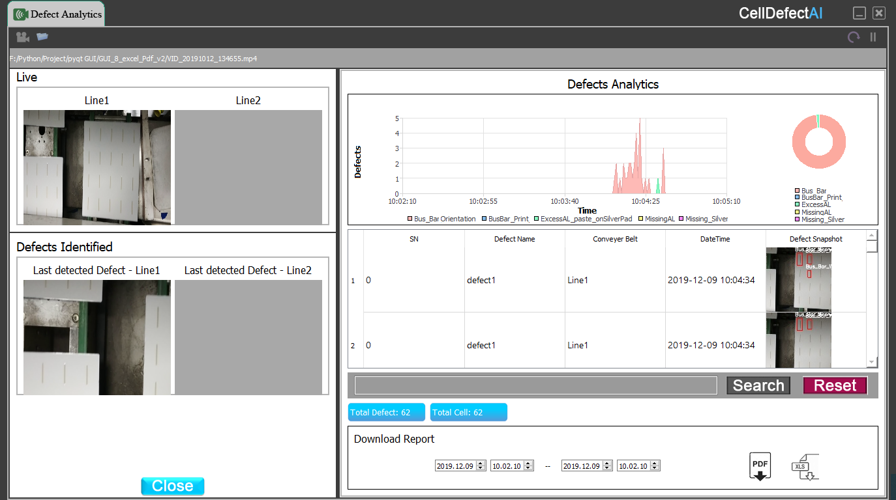

# 实时监测系统

## 系统介绍（Introduction)
[该系统是通过摄像头或者视频文件采集到的图片进行瓷砖的缺陷监测。](https://drive.google.com/file/d/1MvHfjMw95ub_v7nMVenJLKyfPDHJWcLW/view?usp=sharing)  
监测是实时的，监测到的结果是用表格和图表的形式表现出来。  
The system monitors the defects of tiles through pictures collected by cameras or video files.  
The monitoring is real-time, and the results are displayed in the form of tables and charts.   




监测的结果可以保存为PDF, Excel文件。  
Monitoring results can be saved as PDF, Excel files.    


## 系统架构(The Structure of Program)
该系统的整体框架如下图所示。  
The overall framework of the system is shown in the following figure.   

### PyQT GUI 
该系统的界面是由PyQT构成的。  
The interface of the system is composed of PyQT.
```python
#defect.py
#PyQT GUI
import sys
from PyQt5 import QtCore, QtGui, QtWidgets
from PyQt5 import QtWidgets, uic, QtGui, QtCore
from PyQt5.QtCore import *
from PyQt5.QtGui import *
from PyQt5.QtWidgets import *
from PyQt5.QtWidgets import QMessageBox
from PyQt5.QtChart import *

class Ui_DefectAnalytics(object):
    def setupUi(self, DefectAnalytics):
        DefectAnalytics.setObjectName("DefectAnalytics")
        DefectAnalytics.resize(1307, 940)
        DefectAnalytics.setStyleSheet("background-color: rgb(60, 60, 60);")
        self.gridLayout_16 = QtWidgets.QGridLayout(DefectAnalytics)
        self.gridLayout_16.setContentsMargins(-1, 0, -1, 0)
        self.gridLayout_16.setSpacing(0)
        self.gridLayout_16.setObjectName("gridLayout_16")
# ....
```

### 事件处理函数 (Event Handler)
定义每个UI界面的事件处理函数。  
OpenCV监测出来的结果用表格和图表的形式表现出来。  
Define event handlers for each UI interface.  
The results monitored by OpenCV are presented in the form of tables and charts.  
```python
self.openVideoBtn.clicked.connect(self.openVideo)
rMyIcon = QtGui.QPixmap("res/file.png")
self.openVideoBtn.setIcon(QtGui.QIcon(rMyIcon))

self.openCameraBtn.clicked.connect(self.openCamera)
rMyIcon = QtGui.QPixmap("res/camera.png")
self.openCameraBtn.setIcon(QtGui.QIcon(rMyIcon))

self.btnSearch.clicked.connect(self.Search)
rMyIcon = QtGui.QPixmap("res/search.png")
self.btnSearch.setIcon(QtGui.QIcon(rMyIcon))

self.btnReset.clicked.connect(self.Reset)
rMyIcon = QtGui.QPixmap("res/reset.png")
self.btnReset.setIcon(QtGui.QIcon(rMyIcon))

self.btnCloseWarning.clicked.connect(self.closeWarning)
rMyIcon = QtGui.QPixmap("res/close_1.png")
self.btnCloseWarning.setIcon(QtGui.QIcon(rMyIcon))

self.btnDownload.clicked.connect(self.Download)
self.btnDownload.setStyleSheet("background-image: url(res/excel.png); background-attachment: fixed")

self.btnpdfDownload.clicked.connect(self.pdfDownload)
self.btnpdfDownload.setStyleSheet(
    "background-image: url(res/pdf.png); background-attachment: fixed")
```

### MySQL 数据库 （MySQL Database)
**数据库插入 (Insert database)**  

监测出来的结果实时的保存到SQL数据库中。  
The monitored results are saved to the SQL database in real time.
```python
sql = """insert into defect_database.defect_info (defect_name, belt_number, detectedTime, defect_snapshot) values (%s, %s, %s, %s) """
cur_dateTime = datetime.datetime.now().strftime('%Y-%m-%d %H:%M:%S')
conn.cursor().execute(sql, ('defect1', 'Line1', cur_dateTime,blob_value))
conn.commit()
                        
```
**数据库查询(Search Database)**  

利用Search 功能对数据库内容进行检索   
Retrieve database contents using the Search function
```python
def Search(self):
    global imagePath
    defect_name = self.lineEditDefectName.text()
    cursor = conn.cursor()
    cursor.execute("SELECT * from defect_database.defect_info WHERE defect_name = %s", (defect_name,))
    rowCount = 0
    self.defectTableWidget.setRowCount(0)
    for row in cursor.fetchall():
        img_data = row[4]
```

**报告文件导出 PDF Excel Report**   
导出报告文件是选择一定的时间段的数据保存到文件。   
Exporting a report file is to save data to a file for a certain period of time.  
```python
def Download(self):
       
    fromdate = self.fromdateEdit.date().toString("yyyy-MM-dd ")
    fromTime = self.fromTimeEdit.time().toString("hh:mm:ss")

    fromdate = fromdate + fromTime

    todate = self.todateEdit.dateTime().toString("yyyy-MM-dd ")
    toTime = self.toTimeEdit.time().toString("hh:mm:ss")
    todate = todate + toTime

    cursor = conn.cursor()
    sql = "SELECT * from defect_database.defect_info WHERE detectedTime between \'" + fromdate + "\' and \'" + todate + "\'"
    cursor.execute(sql)

```

**数据库内容清除(Delete Database Contents)**
利用 Reset 功能可以清除数据库内容。   
Use the Reset function to clear the database contents.  
```python
def Reset(self):
    conn.cursor().execute("DELETE from defect_database.defect_info WHERE 1")
    self.defectTableWidget.setRowCount(0)
```